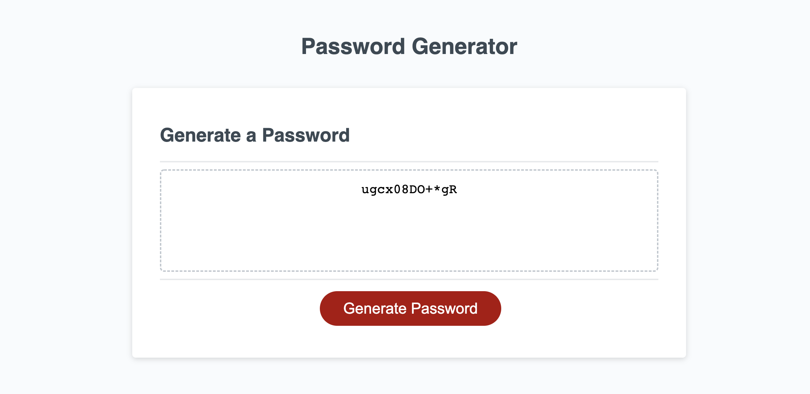

# Javascript-Password-Generator

Password Generator- Work-Home 3

Description: A password is randomly generated based on criteria that the user provides when prompted.
When the user clicks the button "Generate Password" they are first promoted for password length. If outside the range of 8-126, the user is prompted to once again enter a password length within the range. The prompt will loop until the user enters a valid number.
The program then prompts the user to define if they would like to include numbers, characters, uppercase and/or lowercase letters. If the user selects none to all criteria, the program will ask it to select at least each one and will loop back through the prompts.
When all parameters have been defined, the password will appear within the password box.
Languages Used: HTML, CSS, JavaScript.

The Image displays an already "Generated Password":

https://emma4jesus.github.io/Password-Generator-Javascript/
